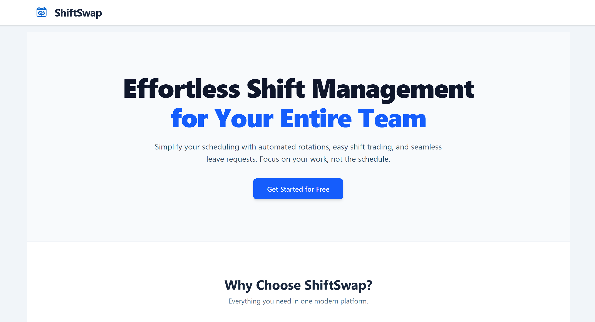
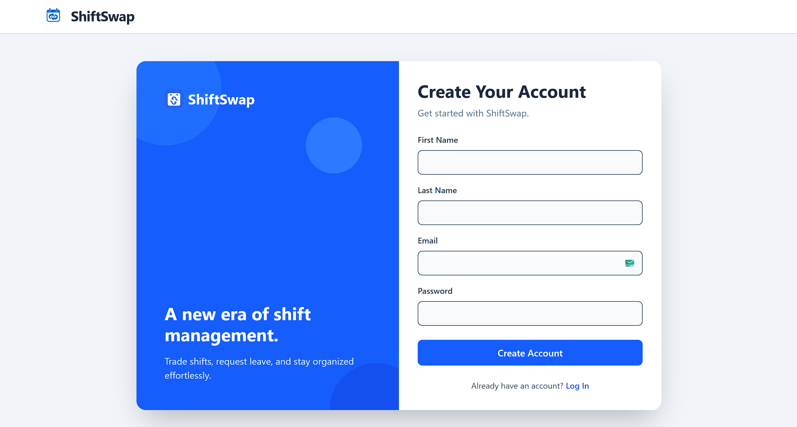
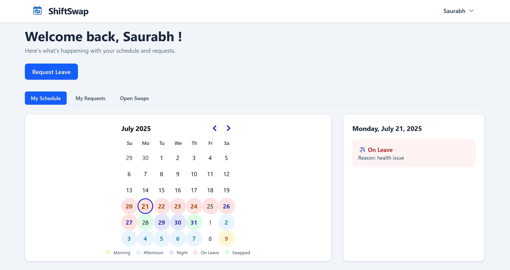
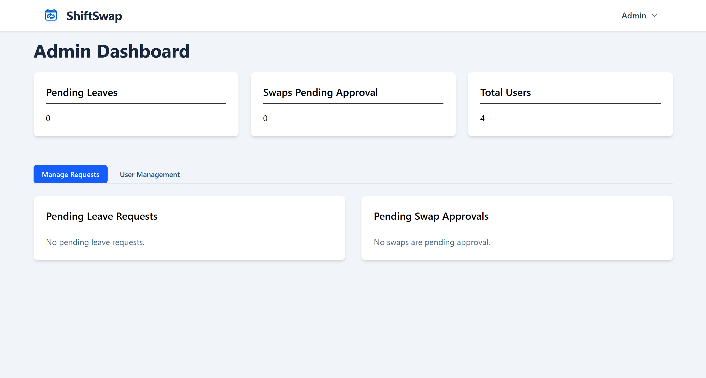

# ShiftSwap - Frontend 🎨

<p align="start">
  
</p>

This is the frontend for the ShiftSwap application, a modern and responsive user interface built with React and Vite. It provides a seamless experience for both employees and administrators to manage their schedules with a focus on a clean, intuitive, and dynamic user experience.

---

## ✨ Key Features

- **Modern UI/UX:** A clean, responsive, and professional design built with Tailwind CSS, featuring smooth animations and an interactive layout.
- **Role-Based Dashboards:** Separate, feature-rich dashboards for Employees and Administrators, providing tailored tools for each user type.
- **Interactive Calendar:** A dynamic calendar serves as the main hub for employees, showing their schedule with color-coded shift types, approved leaves, and completed swaps with unique icons.
- **Intelligent Forms:** Smart, intuitive forms for proposing swaps and requesting leave, with client-side validation that prevents scheduling conflicts and enforces business rules like the 8-hour time limit.
- **Full Request Lifecycle:** Complete user flows for proposing, viewing, accepting, and tracking the history of all shift swaps and leave requests.
- **Global State Management:** Uses React Context for robust authentication and session management across the entire application.

---

## 🛠️ Tech Stack

- **Framework:** React.js (with Vite)
- **Styling:** Tailwind CSS
- **Routing:** React Router DOM
- **API Communication:** Axios
- **Date Management:** date-fns & react-day-picker

---

## 🚀 Getting Started

### Prerequisites

- Node.js (v18 or later recommended)
- A running instance of the **ShiftSwap Backend**.

### Installation & Setup

1.  **Clone the repository:**
    ```bash
    git clone <your-frontend-repo-url>
    cd shift-swap-frontend
    ```

2.  **Install dependencies:**
    ```bash
    npm install
    ```

3.  **Configure API connection:**
    The API base URL is configured in `src/api/axios.js`. By default, it's set to connect to the backend at `http://localhost:5000/api`.

4.  **Run the development server:**
    ```bash
    npm run dev
    ```
    The application will be available at `http://localhost:5173`.

---

## 📸 Screenshots

Here's a glimpse of the ShiftSwap application in action.

| Home Page | Authentication |
| :---: | :---: |
| *A professional landing page with a hero section and feature highlights.* | *A modern, animated, two-panel layout for authentication.* |
|  |  |

| Employee Dashboard | Admin Dashboard |
| :---: | :---: |
| *An interactive calendar showing shifts, leaves, and swaps.* | *A comprehensive view for managing requests and users.* |
|  |  |

